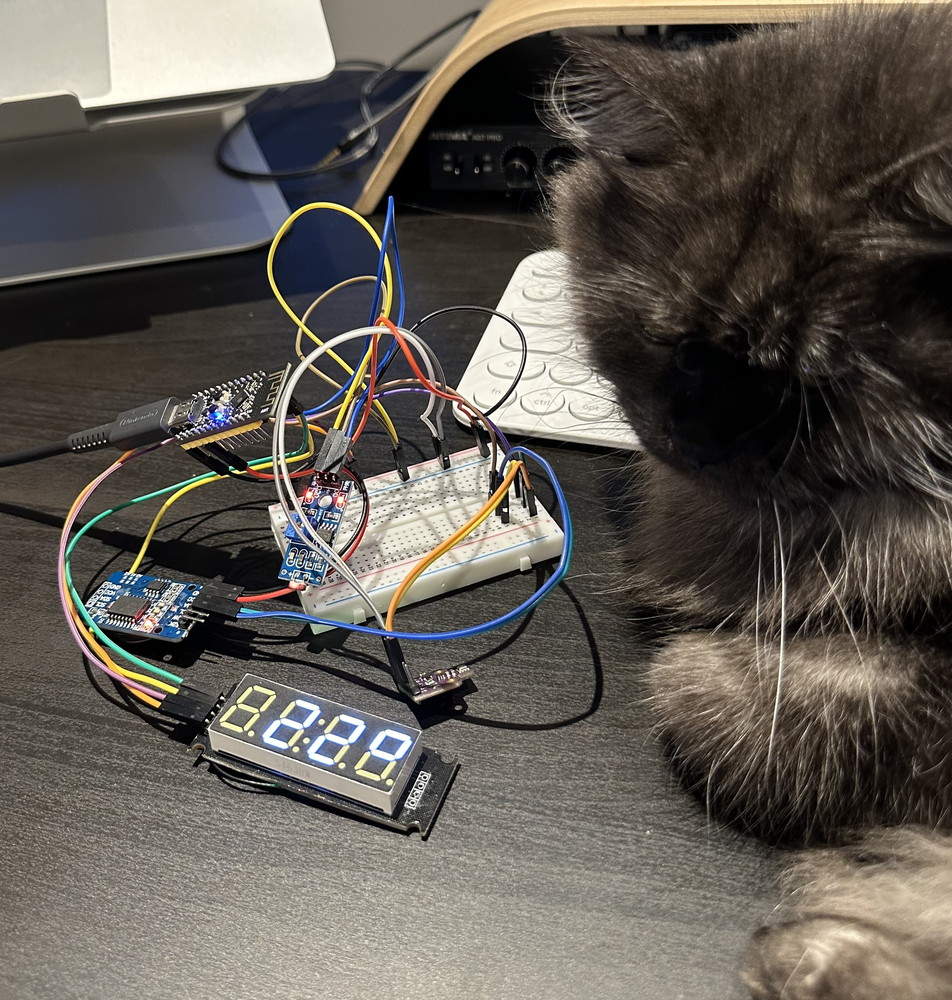
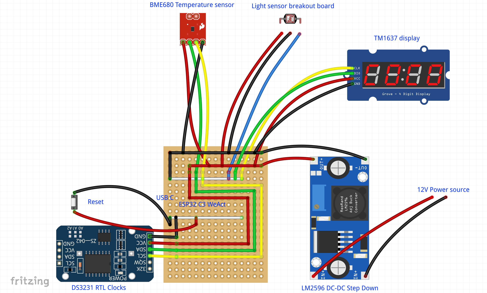
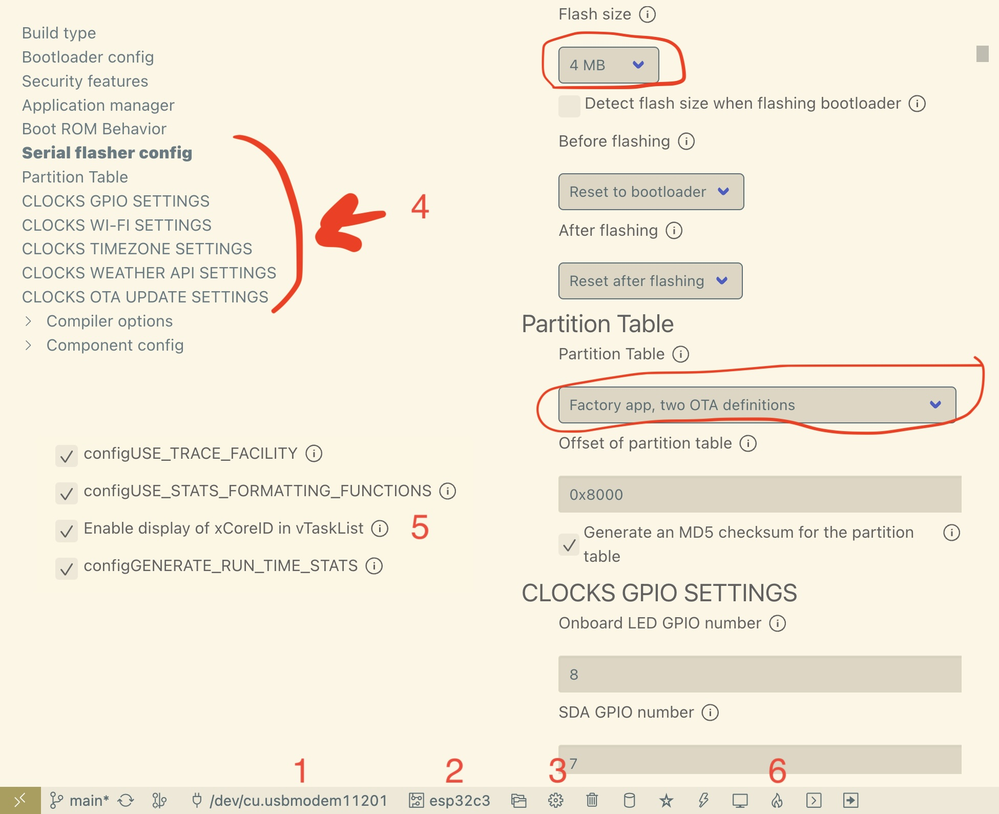

| Supported Targets | ESP32 | ESP32-C2 | ESP32-C3 | ESP32-C6 | ESP32-H2 | ESP32-P4 | ESP32-S2 | ESP32-S3 |
| ----------------- | ----- | -------- | -------- | -------- | -------- | -------- | -------- | -------- |

# ESP32 Clocks (ESP-IDF)

It connects to the Wi-Fi and syncs the time with the NTP server, showing the time and temperature on the screen. Optionally saving it to the external timer and showing the temperature from the sensor + from the API. Supports OTA Wi-Fi updates.




(green wires - data, yellow wires - clock, blue wire - low / high light sensor output)

## Features

- Based on **ESP32** microcontroller (tested with ESP32, ESP32C3 and ESP32S3). I've used the **[WeActStudio ESP32-C3FH4 Core Board](https://github.com/WeActStudio/WeActStudio.ESP32C3CoreBoard)**.

- **TM1637** 7-segment display.
- _Optional:_ **HW-072** Light Sensor. Switching between full and minimal brightness based on the photoresistor.
- _Optional:_ **BME680** environment sensor. Measuring temperature (and optionally humidity).
- _Optional:_ **DS3231** external timer. Saving time to the separate precise clocks.
  Also provides fallback non-precise temperature (+-1.5 C).
- _Optional:_ **Temperature from API** over Wi-Fi and HTTPS. [api.weatherapi.com](https://www.weatherapi.com)
- _Optional:_ **OTA Updates** over Wi-Fi and HTTPS.

## Requirements

The project was created using [ESP-IDF plugin](https://docs.espressif.com/projects/esp-idf/en/latest/esp32/get-started/) for Visual Studio Code and [ESP-IDF-LIB](https://esp-idf-lib.readthedocs.io/en/latest/).

## Initial setup

1. Clone the repo `git clone git@github.com:Flight/clocks.git` and go inside: `cd clocks`.
2. Generate the certificate for weatherapi.com

   `echo -n | openssl s_client -connect 192.168.50.100:443 | sed -ne '/-BEGIN CERTIFICATE-/,/-END CERTIFICATE-/p' > main/temperature_from_api/api_weatherapi_com.pem`

3. Generate a certificate for the OTA Updates. Please **don't forget to fill the server name** on this step:

   **Common Name (e.g. server FQDN or YOUR name) []: 192.168.50.100** (your local IP address).

   `openssl req -newkey rsa:2048 -new -nodes -x509 -days 365 -keyout ota_server/key.pem -out main/ota_update/cert.pem`

4. Change the settings.
   

## Run the project

Run the project using the **ESP-IDF Build, Flash and Monitor** button (number 6 on the screenshot).

## OTA Wi-Fi Updates

### Initial Checklist

- **Flash size** according to the settings on the screenshot (> 4 MB is needed for OTA).
- **Partition table** in settings
- **Firmware upgrade endpoint URL** in the Clocks OTA Update section.
- Generated the **certificate** `main/ota_update/cert.pem`.

### Run OTA Update

1. Run OTA web-server from `ota_server` folder. I'm using this [http-server](https://github.com/http-party/http-server) as **OpenSSL one didn't work properly** and was hanging during download until you don't stop it manually.

   `cd ota_server`

   `npx http-server -S -C ../main/ota_update/cert.pem -p 8070`

2. Drop the file `clocks.bin` to `ota_server` folder or setup the build to generate the output file in that folder.

   You can find the `main.bin` in the `build` folder after you built it. Just copy and rename it to `clocks.bin`.

3. Restart the ESP32. It will automatically start update process in 10 seconds after boot.

4. **Shut down the web server** after update as it will **loop the download process** if the clocks will be manually rebooted again. The version comparison is not implemented yet.

## Folder contents

The project **clocks** contains the entry point file in C language [main.c](main/main.c). The file is located in folder [main](main).

ESP-IDF projects are built using CMake. The project build configuration is contained in `CMakeLists.txt`
files that provide set of directives and instructions describing the project's source files and targets
(executable, library, or both).

Below is short explanation of remaining files in the project folder.

```
├── CMakeLists.txt
├── main
│   ├── CMakeLists.txt
│   └── main.c
└── README.md
```
